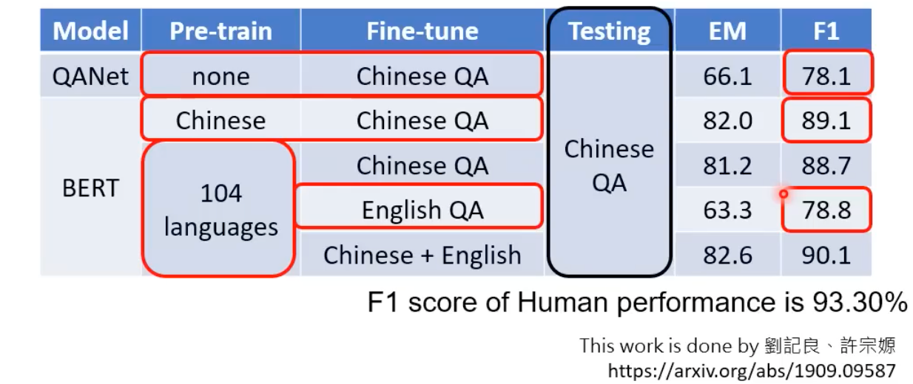

### ChatGPT 模型原理

通过自监督进行预训练并非ChatGPT 专利，其实早在ChatGPT之前已有大部分模型用过这种方法进行训练，比如 Multi-BERT

1. 通过自监督学习进行预训练（得到基石模型,Foundation Model）
2. 监督学习进行微调（这个阶段需要向模型提供正确答案）
3. 使用强化学习再次优化模型（只给出评分而不用给出正确答案）

> 由于基石模型主要用于NLP 领域，很多人不加区分的将其称为大语言模型，Large Language Model——人们发现了一个神奇的现象，但是暂时不知晓其原理，若在多种语言上面进行预训练，然后再以某一个语言，通过监督学习方法训练某一个特定任务，那么模型的能将这项任务的技能泛化于多种不同的语言。接下来的强化学习，也被台湾大学的老师称为 **增强式学习**，ChatGPT 采用这种方法，能在人类也不清楚答案的情况之下取得较好的效果，比如当希望模型写诗、作曲等创作性的、没有标准答案的任务，此时给出评分，显然比起给出一个标准答案更好。

BERT 通过多种语言预训练，再用英文问答数据集 English QA 进行微调，之后测试模型在中文测试集 Chinese QA 上面的表现，发现性能与直接使用中文训练的模型效果差不多。也就是说，预训练阶段，模型掌握多国语言共性的部分。

**Some research direction that  chatGPT brings**

- Prompting Engineering (How to prompt chatGPT)
- AI Generative-Detector (How detect AI generative content)
- Neural Editing (How to finetune to fix bugs without introducing new bugs)
